## Unlocking the Potential of Generative AI in Industrial Operations

The manufacturing industry is undergoing a digital transformation, with industrial leaders leveraging advanced AI and machine learning solutions to enhance productivity and operational efficiency. However, these enterprises face unique challenges in leveraging data-driven solutions. Industrial facilities generate massive volumes of complex unstructured data from sensors, telemetry systems, and equipment spread across production lines and plants. Such real-time data is crucial for use cases like predictive maintenance, anomaly detection, and other analytics applications. But developing and deploying custom ML models for each industrial asset requires significant time and resources from data scientists. As a result, manufacturing/industrial companies find it difficult to scale their AI initiatives across the organization and fully capitalize on advanced analytics. Many promising industrial ML proof-of-concept projects fail to progress beyond pilot stages. The complexities of managing diverse data structures, frequent model retraining requirements, and lack of in-house AI expertise hampers adoption.

## Foundation Models and NLQ

Generative AI using large pre-trained models, known as foundation models (FMs), can rapidly generate a variety of content from conversational text to computer code based on simple text prompts. This eliminates the need for data scientists to manually develop specific ML models for each use case. With versatile FMs such as [Anthropic Claude](https://www.anthropic.com/), multiple AI applications can be supported, significantly reducing development and deployment effort by democratizing access to AI, even small manufacturers can benefit. Workers can become more productive by leveraging AI-generated insights from their operations data. Engineers can detect anomalies early and take preventive action. Supply chain managers can optimize inventories based on production forecasting. Plant leadership can make data-driven strategic decisions to improve quality, equipment utilization and lower costs.

However, standalone FMs today have some limitations in handling complex industrial data. For example, sensor telemetry data from equipment may quickly exceed the context size limits of FM, which is typically [less than 200k tokens](https://www.anthropic.com/index/100k-context-windows). To tackle the FM context window challenge, we can harness FM's capability to generate code in response to natural language queries (NLQ) from end users. Once FM generates relevant code for the analysis, developers can employ agents, such as [PandasAI](https://docs.pandas-ai.com/en/latest/), to execute this code on high-resolution time-series data, and handle potential errors by using FM to correct code errors with error messages. However, complex NLQ queries, requiring multi-level aggregation, pivot or joint table operations, and datetime processing, often yield inconsistent Python script accuracy when using a zero-shot prompt with FM.

## AWS Solutions Architecture and Guidance

To address this, we proposed a solution: dynamically constructing custom multi-shot prompts for NLQ queries, where multi-shot examples were retrieved from an embedding containing Python code examples. This vector embedding is derived from Python code that were successfully executed on similar time series data before, and received positive user feedback. When the end user sends a query, most relevant examples are retrieved from this embedding, and they are added to a custom prompt template before sending to FM. These dynamically generated multi-shot prompts significantly enhance the accuracy and consistency of FM outputs.


The solution's web-based application uses a combination
of [LangChain](https://python.langchain.com/docs/get_started/introduction.html), [Streamlit](https://streamlit.io/), [Amazon OpenSearch Serverless ](https://aws.amazon.com/opensearch-service/serverless-vector-engine/) vector datastore,to dynamically generate multi-shot prompts significantly enhance the accuracy and consistency of FM outputs. The application accepts natural language questions from end-users and returns natural language answers, along with the associated SQL query and Pandas DataFrame-compatible result set.

Following time-series data analysis, maintenance teams can assess industrial asset health status at various granularity levels and use this information to guide maintenance decisions. Besides time-series data analysis, FM can be applied in the following use cases:
• With the latest asset status, maintenance engineers can capture images of broken equipment parts, extract key information with [Amazon Recognition](https://aws.amazon.com/rekognition/), and automatically  generate detailed part functionality summaries with FM. This information aids supply chain providers in offering price quotes and labor estimates.
• For machines in breakdown status, maintenance engineers can query FM to identify potential failure modes and receive recommended maintenance procedures, expediting intelligent searches and accuracy using [Retrieval Augmented Generation (RAG)](https://aws.amazon.com/bedrock/knowledge-bases/) based on enterprise data sources.

To simplify the development of these workflows for industrial customers, AWS introduces [Amazon Bedrock](https://aws.amazon.com/bedrock/), a service enabling easy building and scaling of generative AI applications using state-of-the-art pre-trained FMs like [Claude v2](https://aws.amazon.com/bedrock/claude/). Besides FMs, Amazon Bedrock has [Knowledgebase](https://docs.aws.amazon.com/bedrock/latest/userguide/knowledge-base-add.html) to simplify RAG with FM workflow. In this blog, we showcase a Streamlit application (Intelligent Assistant for Industrial) powered by Amazon Bedrock, addressing the NLQ challenge with time series data, generating part summaries from image using FM and Amazon Recognition, and improving FM responses for equipment root cause diagnosis through the RAG approach.


## Solutions Architecture


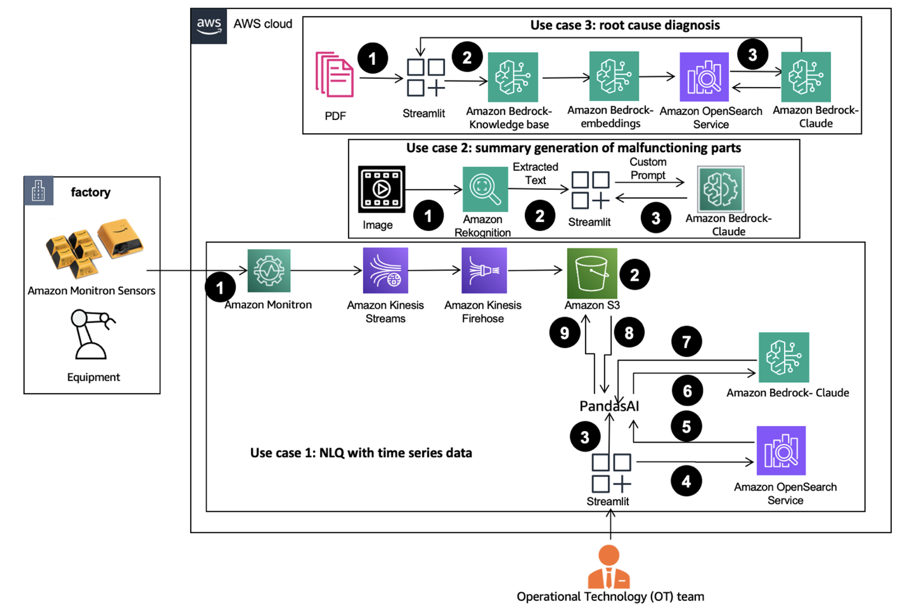

The workflow include three distinct use cases:


### Use Case 1: NLQ with Time-Series Data

1.	Use an equipment monitoring system with ML capability for anomaly detection, such as [Amazon Monitron](https://aws.amazon.com/pm/monitron/), to monitor industrial equipment health.  
2.	Collect time-series data by processing Amazon Monitron data through Kinesis stream and Kinesis Firehose, converting it into a tabular CSV format and saving it in an S3 bucket.
3.	End user can start chatting with their time-series data in S3 via sending natural language query to the Streamlit App. 
4.	The Streamlit app forwards user queries to [Amazon Bedrock Titan Embedding model](https://aws.amazon.com/bedrock/titan/) to embed this query, and perform a similarity search within an OpenSearch index, which contains prior NLQ and example codes. 
5.	After the similarity search, top similar examples are inserted in a custom prompt. PandasAI sends this custom prompt to Amazon Bedrock Claude v2 model. 
6.	The app utilizes the PandasAI agent to interact with the Amazon Bedrock Claude v2 model, generating Python code for Monitron data analysis and NLQ responses.
7.	After Amazon Bedrock Claude v2 model returns the Python code, PandasAI will execute the Python query on the Monitron data uploaded from S3, addressing any necessary retries for failed executions.
8.  The Streamlit App will collect response via PandasAI, and provide the output to users; if satisfactory, you can mark it as "Helpful," saving the NLQ and Claude-generated Python code in OpenSearch.


### Use Case 2: Image Recognition on Assests 

1.	After knowing which industrial asset is broken, user can upload images of broken parts, leveraging the [Amazon Recognition DetectText API](https://docs.aws.amazon.com/rekognition/latest/dg/text-detection.html) to extract text data from these images.
2.	Include the extracted text data in the prompt for the Amazon Bedrock Claude v2 model, enabling FM to generate a 200-word summary of the asset which is in question.


### Use Case 3: Root Cause Diagnosis 

1.	Obtain enterprise data in PDF format related with broken assets, and generate vector embeddings of these documents using Amazon Bedrock Titan Embedding, storing them in the OpenSearch index.
2.	Users pose questions related to root-cause diagnosis for malfunctioning equipment. Answers are generated through a [Retrieval Augmented Generation (RAG)](https://aws.amazon.com/bedrock/knowledge-bases/), employing the knowledge embeddings from the previous step to provide context for RAG.


## Deployment Instructions

### Pre-requisites

   1. You need an AWS account with an [AWS Identity and Access Management (IAM)](https://aws.amazon.com/iam/) role with Admin permissions to manage resources created as part of the solution. For details, refer to [create an AWS account](https://docs.aws.amazon.com/accounts/latest/reference/welcome-first-time-user.html).
   2. For this tutorial, you’ll need a bash terminal with Python 3.9 or higher installed on Linux, Mac, or Windows Subsystem for Linux, and an AWS account. We also recommend using an Amazon Elastic Compute Cloud (Amazon EC2) instance (Ubuntu Server 22.04 LTS).
   3. Install/Update the AWS CLI on either your PC or EC2 instance. 
   4. Amazon Bedrock Model Access, please follow instruction to request access.


### Solution Deployment

#### Step 1:Deploy the 'IndustrialGenAIMainStack': OpenSearch collection and index, SageMaker Notebook instance and S3 bucket

Deploy the 'Opensearchsagemaker.yml' CloudFormation template. Provide the ARN parameter("IAMUserArn") to execute the cloudformation. 

```sh
cd cloudformation/

aws cloudformation create-stack \
  --stack-name genai-sagemaker \
  --template-body file://opensearchsagemaker.yaml \
  --capabilities CAPABILITY_NAMED_IAM \
  --parameters ParameterKey="IAMUserArn",ParameterValue="<REPLACEWITHYOURARN>"
```


#### Step 2: Run Sagemaker Notebook

Open the SageMaker notebook instance created in step 1 in JupyterLab, and you will find the following Github repository already downloaded on this instance: unlocking-the-potential-of-generative-ai-in-industrial-operations. Run the notebook from the following directory in this repository [Notebook:Ingest into OpenSearch](./SagemakerNotebook/nlq-vector-rag-embedding.ipynb): 

unlocking-the-potential-of-generative-ai-in-industrial-operations/SagemakerNotebook/nlq-vector-rag-embedding.ipynb

Please replace the CFN name to the name of the CFN from Step 1. 

#### Step 3: Upload documents from the data folder from this Github repository to S3 bucket. 
You can find the S3 bucket name from “Outputs” of the SFN stack. 
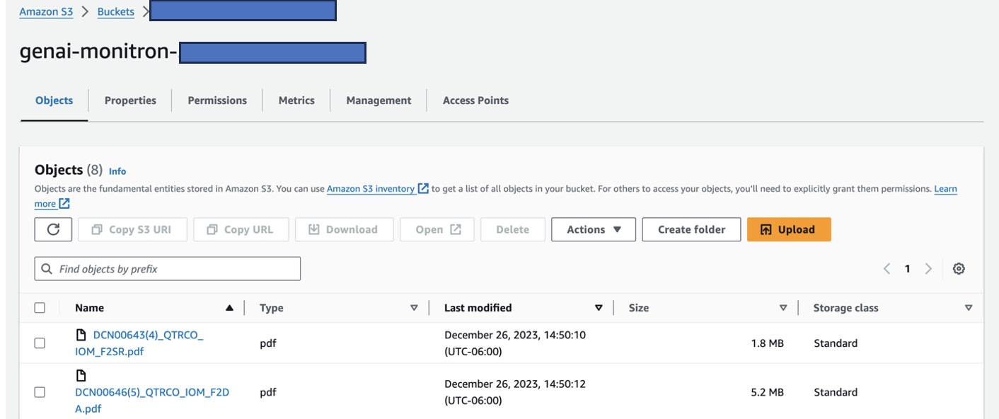
#### Step 4: Manually Create the KnowledgeBase with uploaded documents in S3 in Amazon Bedrock.

(1)	Navigate to the Bedrock Console and click on Knowledge Base and click on the Created Knowledge Base button, next provide a name to your knowledge base and select “Create and use a new service role”.

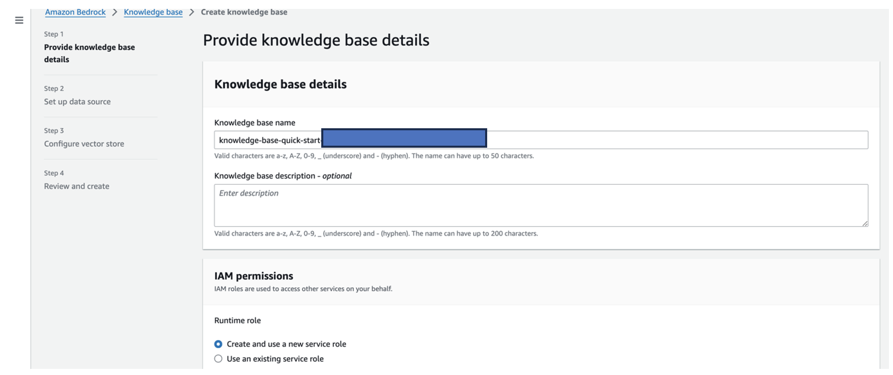


(2)	Next, select the S3 bucket where you uploaded the root cause documents as a data source.

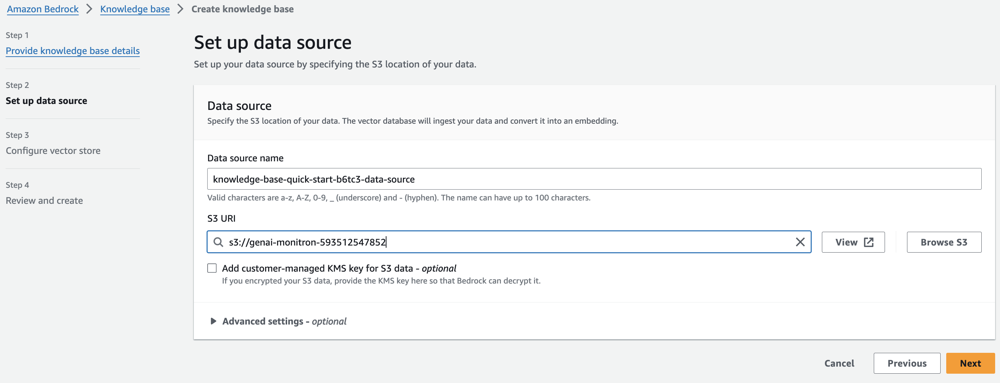


(3)	Select Titan embeddings model and “Quick create a new vector store_Recommended” is automatically selected.

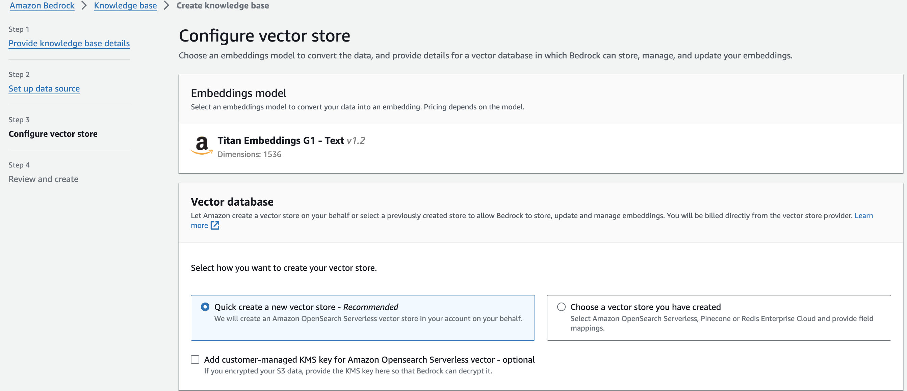
(4)	Review and create the knowledge base by clicking the Create knowledge base button. After the Knowledge Base is successfully created, click on “sync” button to sync the S3 with Knowledge Base.
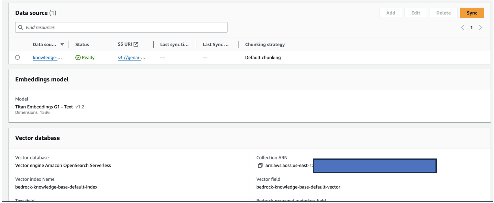
(5)	After you setup the knowledge, you can test the RAG approach for root cause diagnosis from Bedrock Knowledge Base console by asking questions like “My actuator travels slow, what might be the issue?”:
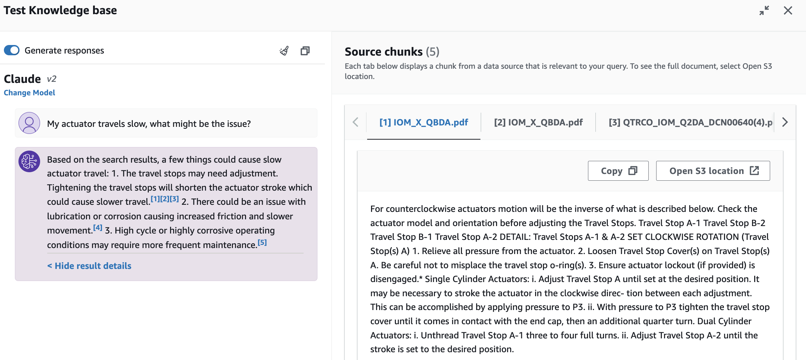

#### Step 5: Deploy the App with required library packages on either your PC or an EC2 instance (Ubuntu Server 22.04 LTS) 

(1) setup AWS credential with AWS CLI on your local PC. If you are using a EC2, please attach a suitable IAM role to the instance.
(2) Clone the GitHub repo: 
```sh
git clone https://github.com/aws-samples/unlocking-the-potential-of-generative-ai-in-industrial-operations
```
(3) Change directory to unlocking-the-potential-of-generative-ai-in-industrial-operations/src, and run the setup.sh to install required packages, including LangChain, and PandasAI.
```sh
cd unlocking-the-potential-of-generative-ai-in-industrial-operations/src
chmod +x ./setup.sh
./setup.sh   
```
(4)Run the Streamlit app with the following command: 
```sh
source monitron-genai/bin/activate
python3 -m streamlit run app_bedrock.py
```
(5) You can access the App from the via localhost on port 8501, which opens a browser window with the web interface. If you deploy the App on a EC2 instance, please allow port 8501 access via the security group inbound rule. 


Note: If you don't have an active Monitron project generating time-series data, utilize the provided [CSV file](./data/monitron_record.csv) with anonymized Monitron project data. Upload this file to the app to kickstart the application. If you already have a Monitron project, you can follow this [blog](https://aws.amazon.com/blogs/machine-learning/generate-actionable-insights-for-predictive-maintenance-management-with-amazon-monitron-and-amazon-kinesis/) to stream your Monitron data to Amazon S3 and use your data with this application.


### NLQ Asset Health Assistant Preview

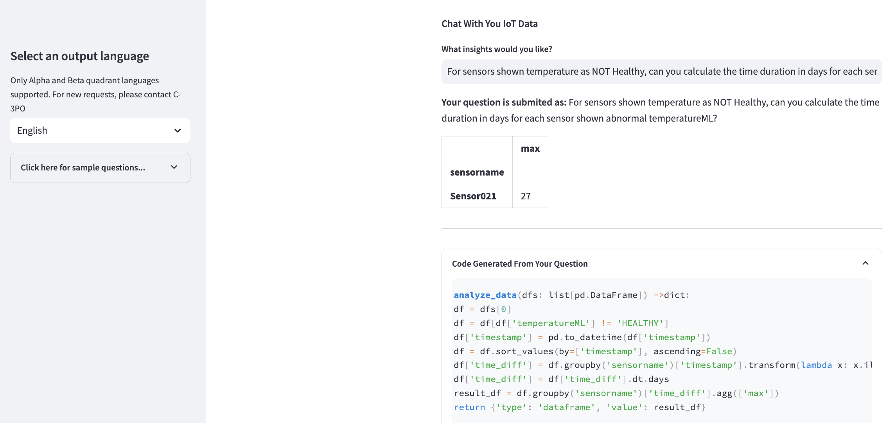


After completing the end-to-end deployment, you can access the app via localhost on port 8501, which opens a brows window with the web interface. You can navigate to different tabs for various use cases. To explore Use Case 1, select "Data Insight and Chart." Begin by uploading your time-series data.The left sidebar offers a range of example questions within the expander section for your convenience. The screenshot below illustrates the response and Python code generated by FM when inputting a question such as, "Count the number of sensors displaying vibrationML_output in Healthy, Warning, and Alarm status, group them by site, and output the result as a dataframe."

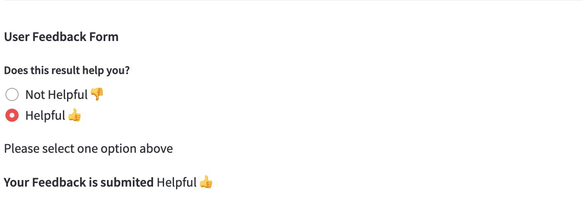

If you are satisfied with the answer, you can mark it as "Helpful," saving the NLQ and Claude-generated Python code to OpenSearch Index.

### Captured Image Summary

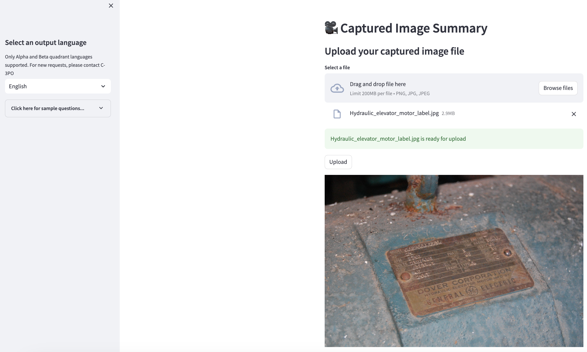
"Hydraulic elevator motor label" by Clarence Risher is licensed under [CCBY-SA2.0] (https://creativecommons.org/licenses/by-sa/2.0/?ref=openverse).
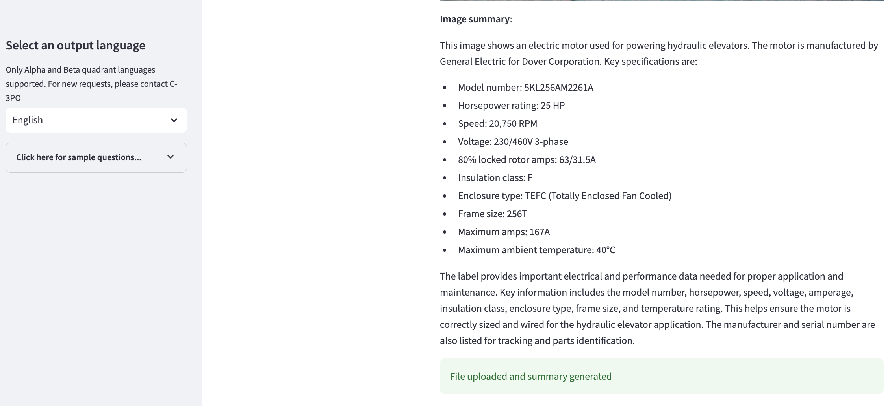


Select the 'Captured Image Summary' tab in the Streamlit App, you can upload an image of your industrial asset, and the application will generate a 200-word summary based on the image information. The following screenshot shows the summary generated from an image of a belt motor drive. 


Note: To test this feature, if you lack a suitable image, you can use the provided example [image](./data/Hydraulic_elevator_motor_label.jpg)


### Root Cause Diagnosis

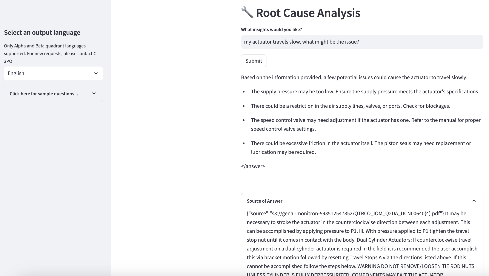


Select the 'Root cause diagnosis' tab. Input a query related with your broken industrial asset, like “My actuator travels slow, what is the problem?” As depicted in the screenshot below, the application delivers a response with URLs to the source documents used to generate the answer in the “Source” section.

## Clean Up

To save costs, delete the following resources you created:
1.	Delete knowledgebase from Amazon Bedrock
2.	Delete OpenSearch index from the console.
3.	Delete the genai-sagemaker cloudformation.
4.	Terminate the EC2 instance if you use an EC2 instance to run the Streamlit app.


## Conclusion

Generative AI applications have already transformed various business processes, enhancing worker productivity and skill sets. However, the limitations of FMs in handling time-series data analysis have hindered their full utilization by industrial clients. This constraint has impeded the application of Generative AI to the predominant data type processed daily.In this blog, we've introduced a Generative AI Application solution designed to alleviate this challenge for industrial users. This application leverages an open-source agent, PandasAI, to bridge the gap between time-series data and FMs provided by Amazon Bedrock Service. Rather than sending time-series data directly to FMs, the app employs PandasAI to generate Python code for the analysis of unstructured time-series data. To enhance the accuracy of Python code generation, a custom prompt generation workflow with human auditing capability has been implemented.Empowered with insights into their asset health, industrial workers can fully harness Generative AI's potential across various use cases, including root cause diagnosis and part replacement planning.

## Security

See [CONTRIBUTING](CONTRIBUTING.md#security-issue-notifications) for more information.

## License

This library is licensed under the MIT-0 License. See the LICENSE file.
